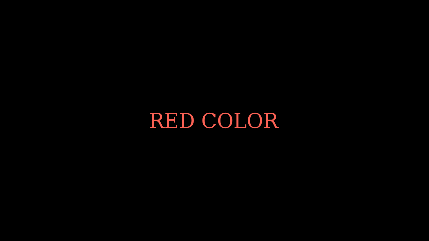

# 渲染文本和公式

您可以通过两种不同的方式在视频中渲染 **文本**：

1.  使用 Pango ( [`text_mobject`]())
2.  使用 LaTeX ( [`tex_mobject`]())

如果您想渲染简单的文本，您应该使用[`Text`]()or [`MarkupText`]()，或其派生之一，例如[`Paragraph`]()。有关详细信息，请参阅[没有 LaTeX 的文本。]()

当你需要数学排版时应该使用 LaTeX。有关详细信息，请参阅 [使用 LaTeX 编写文本。]()

## 没有 LaTeX 的文本

向动画添加文本的最简单方法是使用该类[`Text`]() 。它使用[Pango 库](https://pango.gnome.org)来渲染文本。使用 Pango，您还可以渲染非英语字母，例如 hi 或 こんにちは 或 안녕하세요 或 Мрубя babæה。

这是一个简单的*Hello World*动画。

示例：HelloWorld


```py
from manim import *


class HelloWorld(Scene):
    def construct(self):
        text = Text("Hello world", font_size=144)
        self.add(text)
```

参考：[`Text`]()

您还可以使用[`MarkupText`]()它允许使用 PangoMarkup（有关[`MarkupText`]()详细信息，请参阅 的文档）来渲染文本。例如：

示例：单线颜色


```py
from manim import *

class SingleLineColor(Scene):
    def construct(self):
        text = MarkupText(
            f'all in red <span fgcolor="{YELLOW}">except this</span>', color=RED
        )
        self.add(text)
```

参考：[`MarkupText`]()

### 与`Text`一起工作

本节介绍 的属性[`Text`]()以及如何在动画中使用它。

#### 使用字体

您可以使用 设置不同的字体`font`。

> 笔记

> 使用的字体必须安装在您的系统中，Pango 应该知道它。您可以使用 获取字体列表`manimpango.list_fonts()`。

```sh
>>> import manimpango
>>> manimpango.list_fonts()
[...]
```

示例：字体示例


```py
from manim import *

class FontsExample(Scene):
    def construct(self):
        ft = Text("Noto Sans", font="Noto Sans")
        self.add(ft)
```
#### 设置倾斜度和重量

Slant 是文本的样式，可以是`NORMAL`（默认）， `ITALIC`或`OBLIQUE`。通常，对于许多字体来说，`ITALIC`和 `OBLIQUE`看起来很相似，但`ITALIC`使用**Roman Style**，而 `OBLIQUE`使用**Italic Style**。

粗细指定字体的粗细。您可以在 中看到权重列表 `manimpango.Weight`。

示例：Slants 示例


```py
from manim import *

class SlantsExample(Scene):
    def construct(self):
        a = Text("Italic", slant=ITALIC)
        self.add(a)
```

示例：不同的权重


```py
from manim import *

class DifferentWeight(Scene):
    def construct(self):
        import manimpango

        g = VGroup()
        weight_list = dict(
            sorted(
                {
                    weight: manimpango.Weight(weight).value
                    for weight in manimpango.Weight
                }.items(),
                key=lambda x: x[1],
            )
        )
        for weight in weight_list:
            g += Text(weight.name, weight=weight.name, font="Open Sans")
        self.add(g.arrange(DOWN).scale(0.5))
```

#### 使用颜色

您可以使用以下命令设置文本的颜色`color`：

示例：简单颜色



```py
from manim import *

class SimpleColor(Scene):
    def construct(self):
        col = Text("RED COLOR", color=RED)
        self.add(col)
```

您可以使用诸如`t2c`为特定字符着色之类的实用程序。如果您的文本包含连字（如[迭代文本](#iterating-text)中所述），这可能会出现问题。

`t2c`接受两种类型的词典，

- 键可以包含类似`[2:-1]`或 的索引，这与 Python 中的[切片](https://realpython.com/python-strings/#string-slicing)`[4:8]`工作方式类似 。这些值应该是来自 的文本的颜色。[](https://realpython.com/python-strings/#string-slicing)`Color`
- 键包含应单独着色的单词或字符，值应为以下颜色`Color`：

示例：Textt2c 示例


```py
from manim import *

class Textt2cExample(Scene):
    def construct(self):
        t2cindices = Text('Hello', t2c={'[1:-1]': BLUE}).move_to(LEFT)
        t2cwords = Text('World',t2c={'rl':RED}).next_to(t2cindices, RIGHT)
        self.add(t2cindices, t2cwords)
```
如果您想避免使用颜色时出现问题（由于连字），请考虑使用 `MarkupText`.

#### 使用渐变

您可以使用 添加渐变`gradient`。该值必须是任意长度的可迭代：

示例：渐变示例


```py
from manim import *

class GradientExample(Scene):
    def construct(self):
        t = Text("Hello", gradient=(RED, BLUE, GREEN), font_size=96)
        self.add(t)
```
您还可以使用`t2g`具有文本特定字符的渐变。[它与颜色接口](#using-colors)具有类似的语法：

示例：t2g 示例


```py
from manim import *

class t2gExample(Scene):
    def construct(self):
        t2gindices = Text(
            'Hello',
            t2g={
                '[1:-1]': (RED,GREEN),
            },
        ).move_to(LEFT)
        t2gwords = Text(
            'World',
            t2g={
                'World':(RED,BLUE),
            },
        ).next_to(t2gindices, RIGHT)
        self.add(t2gindices, t2gwords)
```
#### 设置行距

您可以使用以下命令设置行间距`line_spacing`：

示例：行间距


```py
from manim import *

class LineSpacing(Scene):
    def construct(self):
        a = Text("Hello\nWorld", line_spacing=1)
        b = Text("Hello\nWorld", line_spacing=4)
        self.add(Group(a,b).arrange(LEFT, buff=5))
```

#### 禁用连字

通过禁用连字，您将获得字符和子对象之间的一对一映射。这解决了文本着色的问题。

> 警告

> 请注意，将此方法用于严重依赖连字（阿拉伯文本）的文本可能会产生意外结果。

您可以通过传递`disable_ligatures`到 来 禁用连字`Text`。例如：

示例：禁用连字


```py
from manim import *

class DisableLigature(Scene):
    def construct(self):
        li = Text("fl ligature",font_size=96)
        nli = Text("fl ligature", disable_ligatures=True, font_size=96)
        self.add(Group(li, nli).arrange(DOWN, buff=.8))
```

#### 迭代[`Text`]()

文本对象的行为类似于[`VGroups`](). 因此，您可以对文本进行切片和索引。

例如，您可以通过迭代将每个字母设置为不同的颜色。

示例：迭代颜色


```py
from manim import *

class IterateColor(Scene):
    def construct(self):
        text = Text("Colors", font_size=96)
        for letter in text:
            letter.set_color(random_bright_color())
        self.add(text)
```

> 警告

> 请注意，[连字](<https://en.wikipedia.org/wiki/Ligature_(writing)>)可能会在此处引起问题。如果您需要字符到子对象的一对一映射，您应该将参数传递`disable_ligatures`给[`Text`](). 请参阅[禁用连字]()。

### 与`MarkupText`一起工作

MarkupText 与 类似[`Text`]()，它们之间唯一的区别是它接受并处理 PangoMarkup （类似于 html），而不是仅仅渲染纯文本。

[`MarkupText`]()有关 PangoMarkup 的更多详细信息和进一步参考，请参阅 的文档。

示例：标记测试


```py
from manim import *

class MarkupTest(Scene):
    def construct(self):
        text = MarkupText(
            f'<span underline="double" underline_color="green">double green underline</span> in red text<span fgcolor="{YELLOW}"> except this</span>',
            color=RED,
            font_size=34
        )
        self.add(text)
```

## 使用 LaTeX 编写文本

正如您可以用来[`Text`]()向视频添加文本一样，您也可以用来[`Tex`]()插入 LaTeX。

例如，

示例：HelloLaTeX


```py
from manim import *

class HelloLaTeX(Scene):
    def construct(self):
        tex = Tex(r"\LaTeX", font_size=144)
        self.add(tex)
```

> 笔记

> 请注意，我们使用原始字符串 ( `r'...'`) 而不是常规字符串 ( `'...'`)。这是因为 TeX 代码使用了很多特殊字符（例如`\`），这些字符在常规 Python 字符串中具有特殊含义。另一种方法是编写`\\`以避免反斜杠：`Tex('\\LaTeX')`。

### 与`MathTex`一起工作

默认情况下，传递到的所有内容都[`MathTex`]()处于数学模式。更准确地说， [`MathTex`]()是在`align*`环境中进行处理。[`Tex`]()您可以通过用`$`符号 将公式括起来来实现类似的效果`$\xrightarrow{x^6y^8}$`：：

示例：MathTeXDemo


```py
from manim import *

class MathTeXDemo(Scene):
    def construct(self):
        rtarrow0 = MathTex(r"\xrightarrow{x^6y^8}", font_size=96)
        rtarrow1 = Tex(r"$\xrightarrow{x^6y^8}$", font_size=96)

        self.add(VGroup(rtarrow0, rtarrow1).arrange(DOWN))
```

### LaTeX 命令和关键字参数

我们可以使用 AMS 数学包中的任何标准 LaTeX 命令。例如`mathtt`数学文本类型或`looparrowright`箭头。

示例：AMSLaTeX


```py
from manim import *

class AMSLaTeX(Scene):
    def construct(self):
        tex = Tex(r'$\mathtt{H} \looparrowright$ \LaTeX', font_size=144)
        self.add(tex)
```

在 Manim 方面，该类[`Tex`]()还接受属性来更改输出的外观。这与 [`Text`]()类非常相似。例如，`color`关键字更改 TeX mobject 的颜色。

示例：LaTeXAttributes


```py
from manim import *

class LaTeXAttributes(Scene):
    def construct(self):
        tex = Tex(r'Hello \LaTeX', color=BLUE, font_size=144)
        self.add(tex)
```

### 额外的 LaTeX 包

某些命令需要将特殊包加载到 TeX 模板中。例如，要使用`mathscr`脚本，我们需要添加`mathrsfs` 包。由于这个包默认没有加载到 Manim 的 tex 模板中，所以我们必须手动添加它。

示例：AddPackageLatex


```py
from manim import *

class AddPackageLatex(Scene):
    def construct(self):
        myTemplate = TexTemplate()
        myTemplate.add_to_preamble(r"\usepackage{mathrsfs}")
        tex = Tex(
            r"$\mathscr{H} \rightarrow \mathbb{H}$}",
            tex_template=myTemplate,
            font_size=144,
        )
        self.add(tex)
```

### 子串和部分

TeX mobject 可以接受多个字符串作为参数。`tex[1]`之后，您可以通过索引（如）或选择部分 tex 代码来引用各个部分。`\bigstar`在此示例中，我们设置使用的颜色`set_color_by_tex()`：

示例：LaTeXSubstrings


```py
from manim import *

class LaTeXSubstrings(Scene):
    def construct(self):
        tex = Tex('Hello', r'$\bigstar$', r'\LaTeX', font_size=144)
        tex.set_color_by_tex('igsta', RED)
        self.add(tex)
```

请注意，`set_color_by_tex()`为包含 Tex 的整个子字符串着色，而不仅仅是特定符号或 Tex 表达式。考虑以下示例：

示例：不正确的 LaTeXSubstringColoring 


```py
from manim import *

class IncorrectLaTeXSubstringColoring(Scene):
    def construct(self):
        equation = MathTex(
            r"e^x = x^0 + x^1 + \frac{1}{2} x^2 + \frac{1}{6} x^3 + \cdots + \frac{1}{n!} x^n + \cdots"
        )
        equation.set_color_by_tex("x", YELLOW)
        self.add(equation)
```

正如您所看到的，这将整个方程染成黄色，这与预期相反。要仅着色为`x`黄色，我们必须执行以下操作：

示例：正确的 LaTeXSubstringColoring 


```py
from manim import *

class CorrectLaTeXSubstringColoring(Scene):
    def construct(self):
        equation = MathTex(
            r"e^x = x^0 + x^1 + \frac{1}{2} x^2 + \frac{1}{6} x^3 + \cdots + \frac{1}{n!} x^n + \cdots",
            substrings_to_isolate="x"
        )
        equation.set_color_by_tex("x", YELLOW)
        self.add(equation)
```

通过设置`substrings_to_isolate`，`x`我们会自动将 拆分 [`MathTex`]()为子字符串，并将各个`x`组件隔离为单独的子字符串。只有这样才能`set_color_by_tex()`达到预期的效果。

请注意，Manim 还支持自定义语法，可以轻松地将 TeX 字符串拆分为子字符串：只需用双括号将要隔离的公式部分括起来即可。在 string 中 ，渲染的 mobject 将由子字符串, , , , 和组成。这使得使用 可以轻松编写相似文本片段之间的转换。` MathTex(r"{{ a^2 }} + {{ b^2 }} = {{ c^2 }}")``a^2``+``b^2``=``c^2 `[`TransformMatchingTex`]()

### 用于`index_labels`处理复杂的字符串

有时您可能会使用非常复杂的[`MathTex`]()对象，这使得使用其各个组件变得困难。这就是调试功能[`index_labels()`]()非常有用的地方。

该方法显示 mobject 的子 mobject 的索引，使您可以轻松找到要更改的 mobject 的组件。

示例：IndexLabelsMathTex


```py
from manim import *

class IndexLabelsMathTex(Scene):
    def construct(self):
        text = MathTex(r"\binom{2n}{n+2}", font_size=96)

        # index the first (and only) term of the MathTex mob
        self.add(index_labels(text[0]))

        text[0][1:3].set_color(YELLOW)
        text[0][3:6].set_color(RED)
        self.add(text)
```

### LaTeX 数学字体 - 模板库

在排版数学公式时更改 LaTeX 中的字体比常规文本更棘手。它需要更改用于编译 TeX 的模板。Manim 附带了一系列[`TexFontTemplates`]() 可供您使用的工具。这些模板都将在数学模式下工作：

示例：LaTeXMathFonts


```py
from manim import *

class LaTeXMathFonts(Scene):
    def construct(self):
        tex = Tex(
            r"$x^2 + y^2 = z^2$",
            tex_template=TexFontTemplates.french_cursive,
            font_size=144,
        )
        self.add(tex)
```

Manim 还包含[`TexTemplateLibrary`]()3Blue1Brown 使用的 TeX 模板。一个例子是 ctex 模板，用于排版中文脚本。为此，您的系统上必须安装 ctex LaTeX 软件包。[`Tex`]()此外，如果您只是排版文本，您可能根本不需要，而应该使用[`Text`]()。

示例：LaTeXTemplateLibrary


```py
from manim import *

class LaTeXTemplateLibrary(Scene):
    def construct(self):
        tex = Tex('Hello 你好 \\LaTeX', tex_template=TexTemplateLibrary.ctex, font_size=144)
        self.add(tex)
```
### 对齐公式

[`MathTex`]()mobject 在 LaTeX 环境中排版 `align*` 。这意味着您可以在排版多行公式时使用`&`对齐字符：

示例：LaTeXAlignEnvironment


```py
from manim import *

class LaTeXAlignEnvironment(Scene):
    def construct(self):
        tex = MathTex(r'f(x) &= 3 + 2 + 1\\ &= 5 + 1 \\ &= 6', font_size=96)
        self.add(tex)
```

