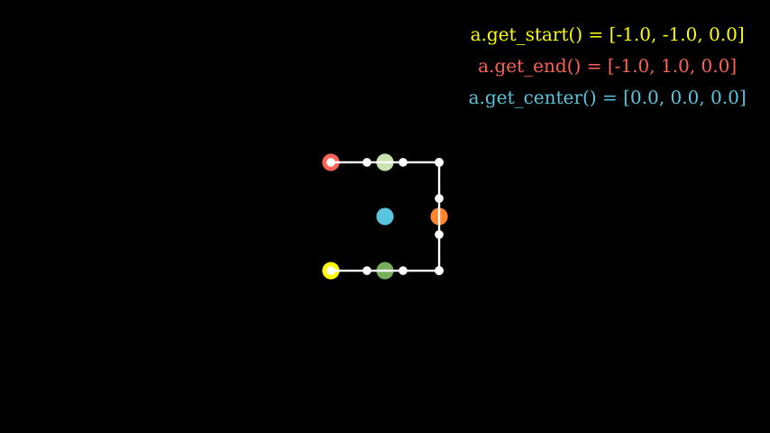

# Manim的构建模块

本文档解释了 manim 的构建块，并将为您提供开始制作自己的视频所需的所有工具。

本质上，manim 为您提供了三个不同的概念，您可以将它们编排在一起以生成数学动画： **数学对象**（或简称**mobject ）、\*\***动画**和 **场景\*\*。正如我们将在以下部分中看到的，这三个概念中的每一个都在 manim 中作为单独的类实现： 、[`Mobject`]()和 [`Animation`]()类[`Scene`]()。

> 笔记

> 建议您在阅读本页之前先阅读教程[快速入门]()和 [Manim 的输出设置。]()

## 对象(Mobjects)

Mobject 是所有 manim 动画的基本构建块。每个派生类[`Mobject`]()代表一个可以在屏幕上显示的对象。例如，[`Circle`]()、 、 [`Arrow`]()、 等简单形状[`Rectangle`]()都是 mobject。更复杂的结构如[`Axes`]()、[`FunctionGraph`]()或 [`BarChart`]()也是 mobject。

[`Mobject`]()如果您尝试在屏幕上显示 的实例，您只会看到一个空框架。原因是该类[`Mobject`]()是所有其他对象的抽象基类，即它不具有任何可以在屏幕上显示的预先确定的视觉形状。它只是一个*可以*展示的事物的骨架。因此，您很少需要使用 ; 的普通实例[`Mobject`]()。相反，您很可能会创建其派生类的实例。这些派生类之一是 [`VMobject`](). 代表`V`矢量化 Mobject。[本质上，vmobject 是使用矢量图形的](https://en.wikipedia.org/wiki/Vector_graphics)mobject[](https://en.wikipedia.org/wiki/Vector_graphics)要显示。大多数时候，您将处理 vmobject，尽管我们将继续使用术语“mobject”来指代可以在屏幕上显示的形状类，因为它更通用。

> 笔记

> 任何可以显示在屏幕上的对象都是 a `mobject`，即使它本质上不一定是*数学的。*

> 提示

> 要查看派生类的示例[`Mobject`]()，请参阅该 [`geometry`]()模块。其中大部分实际上也源自于 [`VMobject`]()。

### 创建并显示 mobject

[正如快速入门]()中所解释的，通常 manim 脚本中的所有代码都放在类[`construct()`]()的方法中[`Scene`]()。要在屏幕上显示 mobject，请调用[`add()`]()包含的方法[`Scene`]()。这是当 mobject 没有动画时在屏幕上显示它的主要方式。要从屏幕上删除 mobject，只需[`remove()`]()从包含的 中调用该方法 即可[`Scene`]()。

#### 示例：创建 Mobjects

[](https://docs.manim.community/en/stable/tutorials/CreatingMobjects-1.mp4)

<iframe src="https://docs.manim.community/en/stable/tutorials/CreatingMobjects-1.mp4"></iframe>

```py
from manim import *

class CreatingMobjects(Scene):
    def construct(self):
        circle = Circle()
        self.add(circle)
        self.wait(1)
        self.remove(circle)
        self.wait(1)
```

### 放置 mobjects

让我们定义一个新的[`Scene`]()名为 它的对象`Shapes`和一些对象。[`add()`]()此脚本生成一个显示圆形、正方形和三角形的静态图片：

#### 示例：图形

[](https://docs.manim.community/en/stable/tutorials/Shapes-1.mp4)

<iframe src="https://docs.manim.community/en/stable/tutorials/Shapes-1.mp4"></iframe>

```py
from manim import *

class Shapes(Scene):
    def construct(self):
        circle = Circle()
        square = Square()
        triangle = Triangle()

        circle.shift(LEFT)
        square.shift(UP)
        triangle.shift(RIGHT)

        self.add(circle, square, triangle)
        self.wait(1)
```

默认情况下，mobject 在首次创建时被放置在坐标中心或*原点。*它们还被赋予了一些默认颜色。进一步地， `Shapes`场景通过该方法放置 mobject [`shift()`]()。`UP`正方形从原点开始沿方向移动一个单位，而圆形和三角形分别移动一个单位`LEFT`和`RIGHT`。

> 注意

> 与其他图形软件不同，manim 将坐标中心放置在屏幕的中心。垂直方向正方向为向上，水平方向正方向为右。另请参见模块中定义的常量`ORIGIN`、`UP`、`DOWN`、`LEFT`、 `RIGHT`和其他常量[`constants`]()。

还有许多其他可能的方法可以将对象放置在屏幕上，例如 [`move_to()`]()、[`next_to()`]()和[`align_to()`]()。下一个场景 `MobjectPlacement`将使用所有三个。

#### 示例：MobjectPlacement

[](https://docs.manim.community/en/stable/tutorials/MobjectPlacement-1.mp4)

<iframe src="https://docs.manim.community/en/stable/tutorials/MobjectPlacement-1.mp4"></iframe>

```py
from manim import *

class MobjectPlacement(Scene):
    def construct(self):
        circle = Circle()
        square = Square()
        triangle = Triangle()

        # place the circle two units left from the origin
        circle.move_to(LEFT * 2)
        # place the square to the left of the circle
        square.next_to(circle, LEFT)
        # align the left border of the triangle to the left border of the circle
        triangle.align_to(circle, LEFT)

        self.add(circle, square, triangle)
        self.wait(1)
```

该[`move_to()`]()方法使用绝对单位（相对于 测量 `ORIGIN`），同时[`next_to()`]()使用相对单位（从作为第一个参数传递的 mobject 测量）。 `align_to()`不用作`LEFT`测量单位，而是作为确定用于对齐的边界的一种方式。对象边界的坐标是使用其周围的假想边界框来确定的。

> 提示

> manim 中的许多方法可以链接在一起。例如这两行

```py
square = Square()
square.shift(LEFT)
```

> 可以替换为

```py
square = Square().shift(LEFT)
```

> 从技术上讲，这是可能的，因为大多数方法调用都会返回修改后的 mobject。

### 样式化对象

以下场景更改了 mobject 的默认美观效果。

#### 示例：MobjectStyling

[](https://docs.manim.community/en/stable/tutorials/MobjectStyling-1.mp4)

<iframe src="https://docs.manim.community/en/stable/tutorials/MobjectStyling-1.mp4"></iframe>

```py
from manim import *

class MobjectStyling(Scene):
    def construct(self):
        circle = Circle().shift(LEFT)
        square = Square().shift(UP)
        triangle = Triangle().shift(RIGHT)

        circle.set_stroke(color=GREEN, width=20)
        square.set_fill(YELLOW, opacity=1.0)
        triangle.set_fill(PINK, opacity=0.5)

        self.add(circle, square, triangle)
        self.wait(1)
```

该场景使用两个主要函数来更改 mobject 的视觉样式：`set_stroke()`和[`set_fill()`]()。前者改变对象边框的视觉风格，而后者改变内部的风格。默认情况下，大多数 mobject 具有完全透明的内部，因此您必须指定参数`opacity`来显示颜色。不透明度`1.0`表示完全不透明，而`0.0`表示完全透明。

仅[`VMobject`]()实现`set_stroke()`和 的实例[`set_fill()`]()。[`Mobject`]()相反，实施 的实例`set_color()`。绝大多数预定义类都是派生自的[`VMobject`]()，因此通常可以安全地假设您有权访问`set_stroke()`和[`set_fill()`]()。

### Mobject 屏幕顺序

下一个场景与上一节的场景完全相同`MobjectStyling`，除了一行之外。

#### 示例：MobjectZOrder

[](https://docs.manim.community/en/stable/tutorials/MobjectZOrder-1.mp4)

<iframe src="https://docs.manim.community/en/stable/tutorials/MobjectZOrder-1.mp4"></iframe>

```py
from manim import *

class MobjectZOrder(Scene):
    def construct(self):
        circle = Circle().shift(LEFT)
        square = Square().shift(UP)
        triangle = Triangle().shift(RIGHT)

        circle.set_stroke(color=GREEN, width=20)
        square.set_fill(YELLOW, opacity=1.0)
        triangle.set_fill(PINK, opacity=0.5)

        self.add(triangle, square, circle)
        self.wait(1)
```

这里唯一的区别（除了场景名称）是 mobject 添加到场景的顺序。在 中`MobjectStyling`，我们将它们添加为 ，而在 中，我们将它们添加为 。` add(circle, square, triangle)``MobjectZOrder``add(triangle, square, circle) `

正如您所看到的，参数的顺序[`add()`]()决定了 mobject 在屏幕上显示的顺序，最左边的参数放在后面。

## 动画

Manim 的核心是动画。通常，您可以通过调用该方法向场景添加动画[`play()`]()。

#### 示例：一些动画

[](https://docs.manim.community/en/stable/tutorials/SomeAnimations-1.mp4)

<iframe src="https://docs.manim.community/en/stable/tutorials/SomeAnimations-1.mp4"></iframe>

```py
from manim import *

class SomeAnimations(Scene):
    def construct(self):
        square = Square()

        # some animations display mobjects, ...
        self.play(FadeIn(square))

        # ... some move or rotate mobjects around...
        self.play(Rotate(square, PI/4))

        # some animations remove mobjects from the screen
        self.play(FadeOut(square))

        self.wait(1)
```

简而言之，动画是在两个对象之间进行插值的过程。例如，`FadeIn(square)`以完全透明版本开始， `square`以完全不透明版本结束，通过逐渐增加不透明度在它们之间进行插值。 [`FadeOut`]()以相反的方式工作：它从完全不透明插值到完全透明。作为另一个示例，[`Rotate`]()从作为参数传递给它的 mobject 开始，并以相同的对象但旋转一定量结束，这次插入 mobject 的角度而不是其不透明度。

### 动画方法

mobject 的任何可以更改的属性都可以设置动画。事实上，任何改变 mobject 属性的方法都可以通过使用[`animate()`]().

#### 示例：AnimateExample

[](https://docs.manim.community/en/stable/tutorials/AnimateExample-2.mp4)

<iframe src="https://docs.manim.community/en/stable/tutorials/AnimateExample-2.mp4"></iframe>

```py
from manim import *

class AnimateExample(Scene):
    def construct(self):
        square = Square().set_fill(RED, opacity=1.0)
        self.add(square)

        # animate the change of color
        self.play(square.animate.set_fill(WHITE))
        self.wait(1)

        # animate the change of position and the rotation at the same time
        self.play(square.animate.shift(UP).rotate(PI / 3))
        self.wait(1)
```

参考：[`Animation`]()

[`animate()`]()是所有 mobject 的一个属性，它为随后出现的方法提供动画效果。例如，`square.set_fill(WHITE)`设置正方形的填充颜色，同时`square.animate.set_fill(WHITE)`为该动作设置动画。

### 动画运行时间

默认情况下，传递给的任何动画都会`play()`持续一秒钟。使用`run_time`参数来控制持续时间。

#### 示例：运行时

[](https://docs.manim.community/en/stable/tutorials/RunTime-1.mp4)

<iframe src="https://docs.manim.community/en/stable/tutorials/RunTime-1.mp4"></iframe>

```py
from manim import *

class RunTime(Scene):
    def construct(self):
        square = Square()
        self.add(square)
        self.play(square.animate.shift(UP), run_time=3)
        self.wait(1)
```

### 创建自定义动画

尽管 Manim 有许多内置动画，但您有时会需要从一种状态平滑地制作动画[`Mobject`]()到另一种状态。如果您发现自己处于这种情况，那么您可以定义自己的自定义动画。您首先扩展该类[`Animation`]()并覆盖它的[`interpolate_mobject()`](). 该[`interpolate_mobject()`]()方法接收 alpha 作为参数，该参数从 0 开始并在整个动画中发生变化。因此，您只需根据其 interpolate_mobject 方法中的 alpha 值在 Animation 内部操作 self.mobject 即可。然后您将获得所有好处，[`Animation`]()例如播放不同的运行时间或使用不同的速率函数。

假设您从一个数字开始，并想要创建一个[`Transform`]()将其转换为目标数字的动画。您可以使用 来做到这一点[`FadeTransform`]()，这将淡出起始数字并淡入目标数字。但是，当我们考虑将一个数字转换为另一个数字时，一种直观的方法是平滑地递增或递减它。Manim 有一项功能，允许您通过定义自己的自定义动画来自定义此行为。

您可以从创建自己的`Count`扩展类开始[`Animation`]()。该类可以有一个带有三个参数的构造函数：[`DecimalNumber`]()Mobject、start 和 end。构造函数会将[`DecimalNumber`]()Mobject 传递给超级构造函数（在本例中为[`Animation`]()构造函数），并设置开始和结束。

您唯一需要做的就是定义您希望它如何看待动画的每个步骤。[`interpolate_mobject()`]()Manim 在基于视频帧速率、速率函数和播放动画的运行时间的方法中为您提供 alpha 值。alpha 参数保存一个介于 0 和 1 之间的值，表示当前播放动画的步长。例如，0 表示动画开始，0.5 表示动画进行到一半，1 表示动画结束。

对于动画`Count`，您只需找到一种方法来确定在给定 alpha 值处显示的数字，然后在[`interpolate_mobject()`]()动画方法中设置该值`Count`。假设您从 50 开始并递增，直到[`DecimalNumber`]()动画结束时达到 100。

- 如果 alpha 为 0，您希望该值为 50。
- 如果 alpha 为 0.5，则您希望该值为 75。
- 如果 alpha 为 1，您希望该值为 100。

通常，您从起始数字开始，仅添加要根据 alpha 值递增的部分值。因此，计算每一步要显示的数字的逻辑将是。一旦您设置了 的计算值，您就完成了。`50 + alpha * (100 - 50)`[`DecimalNumber`]()

定义动画后，您可以使用任何速率函数在您想要的任何持续时间内`Count`播放它。[`Scene`]()[`DecimalNumber`]()

#### 示例：计数场景

[](https://docs.manim.community/en/stable/tutorials/CountingScene-1.mp4)

<iframe src="https://docs.manim.community/en/stable/tutorials/CountingScene-1.mp4"></iframe>

```py
from manim import *

class Count(Animation):
    def __init__(self, number: DecimalNumber, start: float, end: float, **kwargs) -> None:
        # Pass number as the mobject of the animation
        super().__init__(number,  **kwargs)
        # Set start and end
        self.start = start
        self.end = end

    def interpolate_mobject(self, alpha: float) -> None:
        # Set value of DecimalNumber according to alpha
        value = self.start + (alpha * (self.end - self.start))
        self.mobject.set_value(value)


class CountingScene(Scene):
    def construct(self):
        # Create Decimal Number and add it to scene
        number = DecimalNumber().set_color(WHITE).scale(5)
        # Add an updater to keep the DecimalNumber centered as its value changes
        number.add_updater(lambda number: number.move_to(ORIGIN))

        self.add(number)

        self.wait()

        # Play the Count Animation to count from 0 to 100 in 4 seconds
        self.play(Count(number, 0, 100), run_time=4, rate_func=linear)

        self.wait()
```

参考：[`Animation`]() [`DecimalNumber`]() [`interpolate_mobject()`]() [`play()`]()

### 使用 mobject 的坐标

Mobject 包含定义其边界的点。这些点可用于将其他 mobject 分别添加到彼此，例如通过[`get_center()`]()、[`get_top()`]() 和 等方法[`get_start()`]()。以下是一些重要坐标的示例：

#### 示例：MobjectExample 



```py
from manim import *

class MobjectExample(Scene):
    def construct(self):
        p1= [-1,-1,0]
        p2= [1,-1,0]
        p3= [1,1,0]
        p4= [-1,1,0]
        a = Line(p1,p2).append_points(Line(p2,p3).points).append_points(Line(p3,p4).points)
        point_start= a.get_start()
        point_end  = a.get_end()
        point_center = a.get_center()
        self.add(Text(f"a.get_start() = {np.round(point_start,2).tolist()}", font_size=24).to_edge(UR).set_color(YELLOW))
        self.add(Text(f"a.get_end() = {np.round(point_end,2).tolist()}", font_size=24).next_to(self.mobjects[-1],DOWN).set_color(RED))
        self.add(Text(f"a.get_center() = {np.round(point_center,2).tolist()}", font_size=24).next_to(self.mobjects[-1],DOWN).set_color(BLUE))

        self.add(Dot(a.get_start()).set_color(YELLOW).scale(2))
        self.add(Dot(a.get_end()).set_color(RED).scale(2))
        self.add(Dot(a.get_top()).set_color(GREEN_A).scale(2))
        self.add(Dot(a.get_bottom()).set_color(GREEN_D).scale(2))
        self.add(Dot(a.get_center()).set_color(BLUE).scale(2))
        self.add(Dot(a.point_from_proportion(0.5)).set_color(ORANGE).scale(2))
        self.add(*[Dot(x) for x in a.points])
        self.add(a)
```

### 将 mobject 转换为其他 mobject 

也可以将一个 mobject 转换为另一个 mobject，如下所示：

#### 示例：示例变换

[](https://docs.manim.community/en/stable/tutorials/ExampleTransform-1.mp4)

<iframe src="https://docs.manim.community/en/stable/tutorials/ExampleTransform-1.mp4"></iframe>

```py
from manim import *

class ExampleTransform(Scene):
    def construct(self):
        self.camera.background_color = WHITE
        m1 = Square().set_color(RED)
        m2 = Rectangle().set_color(RED).rotate(0.2)
        self.play(Transform(m1,m2))
```

Transform 函数将前一个 mobject 的点映射到下一个 mobject 的点。这可能会导致奇怪的行为，例如，当一个对象的点顺时针排列而其他点逆时针排列时。在这里，使用翻转函数并通过 numpy 的[滚动](https://numpy.org/doc/stable/reference/generated/numpy.roll.html)函数重新定位点 可能会有所帮助：

#### 示例：示例旋转
[](https://docs.manim.community/en/stable/tutorials/ExampleRotation-1.mp4)

<iframe src="https://docs.manim.community/en/stable/tutorials/ExampleRotation-1.mp4"></iframe>

```py
from manim import *

class ExampleRotation(Scene):
    def construct(self):
        self.camera.background_color = WHITE
        m1a = Square().set_color(RED).shift(LEFT)
        m1b = Circle().set_color(RED).shift(LEFT)
        m2a= Square().set_color(BLUE).shift(RIGHT)
        m2b= Circle().set_color(BLUE).shift(RIGHT)

        points = m2a.points
        points = np.roll(points, int(len(points)/4), axis=0)
        m2a.points = points

        self.play(Transform(m1a,m1b),Transform(m2a,m2b), run_time=1)
```

## 场景

该类[`Scene`]()是马尼姆结缔组织。每个对象都必须[`added`]()指向一个要显示的场景，或者[`removed`]()从该场景停止显示。每个动画都必须 [`played`]()由一个场景组成，并且每个不发生动画的时间间隔都由对 的调用确定[`wait()`]()。视频的所有代码必须包含在[`construct()`]()派生自 的类的方法中[`Scene`]()。[`Scene`]()最后，如果要同时渲染多个场景，单个文件可能包含多个子类。
